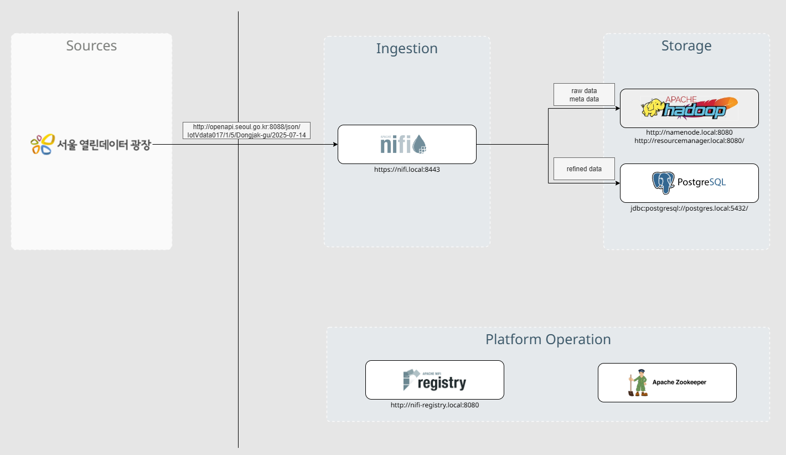
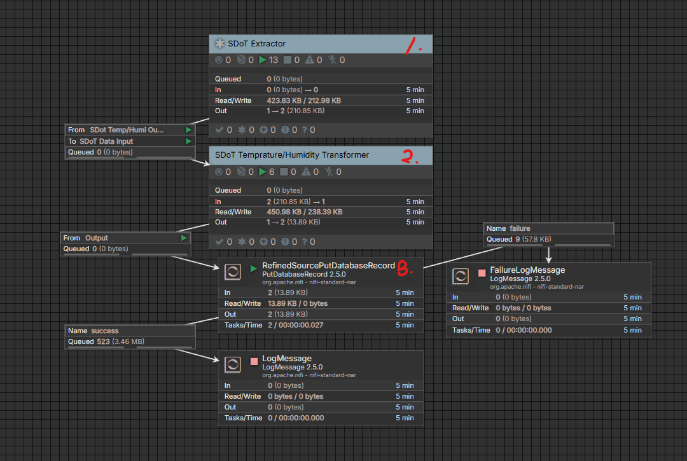
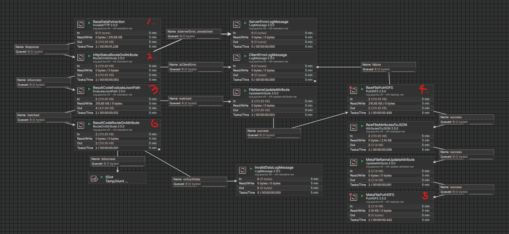
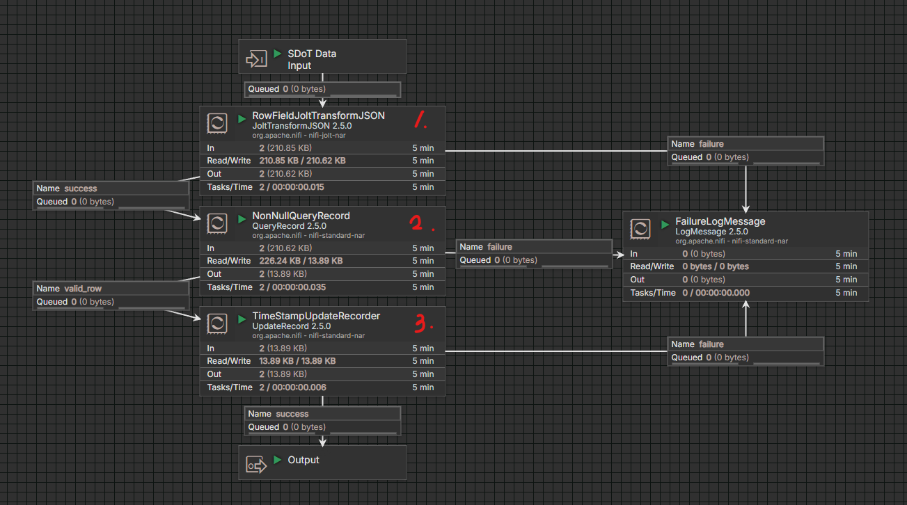
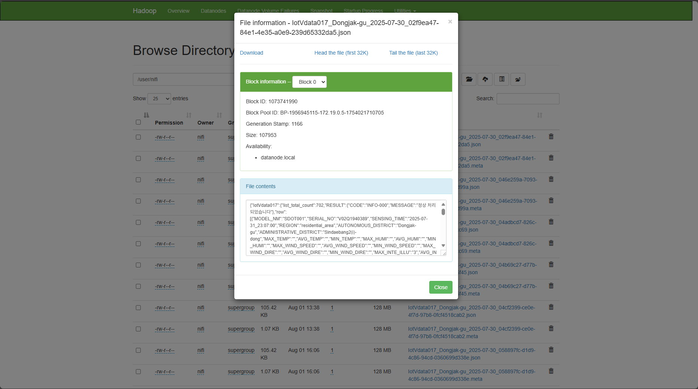
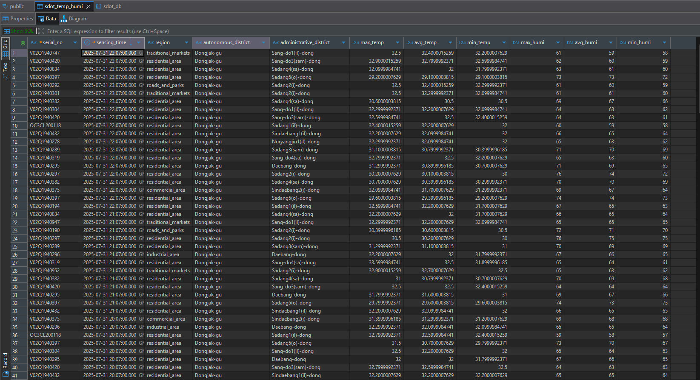
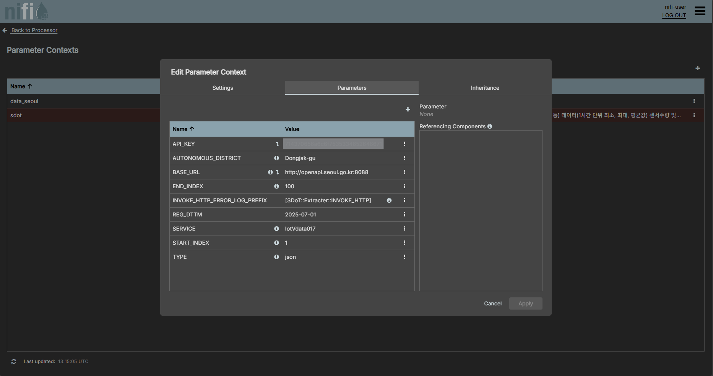

Table of Content

- [스마트서울 온습도 데이터 파이프라인 실습](#스마트서울-온습도-데이터-파이프라인-실습)
  - [프로젝트 목표](#프로젝트-목표)
  - [데이터 분석](#데이터-분석)
      - [Script 1. 샘플 데이터 (json)](#script-1-샘플-데이터-json)
      - [Table 1. 샘플 데이터](#table-1-샘플-데이터)
      - [Table 2. 출력값 (간략)](#table-2-출력값-간략)
      - [Table 3. 요청결과 코드 및 메시지](#table-3-요청결과-코드-및-메시지)
    - [분석 요약 및 방향](#분석-요약-및-방향)
  - [주요 기술 및 구성 요소](#주요-기술-및-구성-요소)
  - [시스템 아키텍쳐](#시스템-아키텍쳐)
    - [서비스 주소](#서비스-주소)
  - [주요 기능](#주요-기능)
  - [시작하기](#시작하기)
    - [실행환경](#실행환경)
    - [실행방법](#실행방법)
  - [구현 내용](#구현-내용)
    - [전체 흐름도](#전체-흐름도)
    - [추출 흐름도](#추출-흐름도)
    - [변경 흐름도](#변경-흐름도)
  - [결과](#결과)
      - [Script 2: IotVdata017\_Dongjak-gu\_2025-07-30\_02f9ea47-84e1-4e35-a0e9-239d65332da5.json](#script-2-iotvdata017_dongjak-gu_2025-07-30_02f9ea47-84e1-4e35-a0e9-239d65332da5json)
      - [Script 3: IotVdata017\_Dongjak-gu\_2025-07-30\_02f9ea47-84e1-4e35-a0e9-239d65332da5.meta](#script-3-iotvdata017_dongjak-gu_2025-07-30_02f9ea47-84e1-4e35-a0e9-239d65332da5meta)
  - [세부 구현](#세부-구현)
      - [버전 및 인증서 관리](#버전-및-인증서-관리)
    - [HTTP 수집 처리](#http-수집-처리)
      - [에러 처리](#에러-처리)
      - [응답 처리](#응답-처리)
    - [데이터 변환](#데이터-변환)
      - [데이터 저장](#데이터-저장)
      - [서비스 제공](#서비스-제공)
  - [문제 및 해결 과정](#문제-및-해결-과정)
    - [Nifi 클러스터 구축 후 데이터 무결성 문제](#nifi-클러스터-구축-후-데이터-무결성-문제)
    - [Hadoop 라이브러리 Deprecated 문제](#hadoop-라이브러리-deprecated-문제)
  - [발전 방향](#발전-방향)
    - [메시지 분산 및 안정성 강화](#메시지-분산-및-안정성-강화)
    - [실시간 데이터 처리 확장](#실시간-데이터-처리-확장)
    - [인증 및 권한 관리 체계 강화](#인증-및-권한-관리-체계-강화)
    - [모니터링 및 로깅 체계 고도화](#모니터링-및-로깅-체계-고도화)


# 스마트서울 온습도 데이터 파이프라인 실습

이 프로젝트는 Apache NiFi를 기반하여 스마트서울 도시데이터 센서(S-DoT) 환경정보[(link)](https://data.seoul.go.kr/dataList/OA-15969/S/1/datasetView.do#)의 온·습도 데이터를 매일 자동으로 수집하고, 변환하여 PostgreSQL 및 Hadoop에 저장하는 파이프라인을 구축합니다.

## 프로젝트 목표

해당 프로젝트의 목표는 아래와 같습니다.

* Apache NiFi를 활용해 데이터 수집, 변환, 적재 파이프라인을 구현.
* 스마트서울 열린 데이터 광장의 S-DoT 환경정보 API에서 온도·습도 등 유의미한 데이터를 수집.
* 초기에는 단일 노드 환경에서 시작하되, HA 확보를 위해 클러스터를 구축.

## 데이터 분석

#### Script 1. 샘플 데이터 (json)

```json
{
  "IotVdata017": {
    "list_total_count": 742,
    "RESULT": { "CODE": "INFO-000", "MESSAGE": "정상 처리되었습니다" },
    "row": [
      {
        "MODEL_NM": "SDOT001",
        "SERIAL_NO": "V02Q1940947",
        "SENSING_TIME": "2025-07-14_23:07:00",
        "REGION": "traditional_markets",
        "AUTONOMOUS_DISTRICT": "Dongjak-gu",
        "ADMINISTRATIVE_DISTRICT": "Sang-do1(il)-dong",
        "MAX_TEMP": "21.9",
        "AVG_TEMP": "21.8",
        "MIN_TEMP": "21.6",
        "MAX_HUMI": "",
        "AVG_HUMI": "",
        "MIN_HUMI": "",
        "MAX_NOISE": "59",
        "AVG_NOISE": "56",
        "MIN_NOISE": "56",
        "REG_DTTM": "2025-07-14 23:08:21"
        // ...
      }
      // ...
    ]
  }
}
```

#### Table 1. 샘플 데이터

| MODEL_NM | SERIAL_NO   | SENSING_TIME        | REGION              | AUTONOMOUS_DISTRICT | ADMINISTRATIVE_DISTRICT | MAX_TEMP | AVG_TEMP | MIN_TEMP | MAX_HUMI | AVG_HUMI | MIN_HUMI | MAX_WIND_SPEED | AVG_WIND_SPEED | MIN_WIND_SPEED | MAX_WIND_DIRE | AVG_WIND_DIRE | MIN_WIND_DIRE | MAX_INTE_ILLU | AVG_INTE_ILLU | MIN_INTE_ILLU | MAX_ULTRA_RAYS | AVG_ULTRA_RAYS | MIN_ULTRA_RAYS | MAX_NOISE | AVG_NOISE | MIN_NOISE | MAX_VIBR_X | AVG_VIBR_X | MIN_VIBR_X | MAX_VIBR_Y | AVG_VIBR_Y | MIN_VIBR_Y | MAX_VIBR_Z | AVG_VIBR_Z | MIN_VIBR_Z | MAX_EFFE_TEMP | AVG_EFFE_TEMP | MIN_EFFE_TEMP | MAX_NO2 | AVG_NO2 | MIN_NO2 | MAX_CO | AVG_CO | MIN_CO | MAX_SO2 | AVG_SO2 | MIN_SO2 | MAX_NH3 | AVG_NH3 | MIN_NH3 | MAX_H2S | AVG_H2S | MIN_H2S | MAX_O3 | AVG_O3 | MIN_O3 | REG_DTTM            |
| -------- | ----------- | ------------------- | ------------------- | ------------------- | ----------------------- | -------- | -------- | -------- | -------- | -------- | -------- | -------------- | -------------- | -------------- | ------------- | ------------- | ------------- | ------------- | ------------- | ------------- | -------------- | -------------- | -------------- | --------- | --------- | --------- | ---------- | ---------- | ---------- | ---------- | ---------- | ---------- | ---------- | ---------- | ---------- | ------------- | ------------- | ------------- | ------- | ------- | ------- | ------ | ------ | ------ | ------- | ------- | ------- | ------- | ------- | ------- | ------- | ------- | ------- | ------ | ------ | ------ | ------------------- |
| SDOT001  | V02Q1940947 | 2025-07-14_23:07:00 | traditional_markets | Dongjak-gu          | Sang-do1(il)-dong       | 21.9     | 21.8     | 21.6     |          |          |          |                |                |                |               |               |               | 0             | 0             | 0             | 0.0            | 0.0            | 0.0            | 59        | 56        | 56        | 0.07       | 0.06       | 0.06       | 0.04       | 0.04       | 0.03       | 1.01       | 1.01       | 1.0        |               |               |               |         |         |         |        |        |        |         |         |         |         |         |         |         |         |         |        |        |        | 2025-07-14 23:08:21 |
| SDOT001  | V02Q1940292 | 2025-07-14_23:07:00 | roads_and_parks     | Dongjak-gu          | Sadang2(i)-dong         | 22.3     | 21.9     | 21.7     |          |          |          |                |                |                |               |               |               | 5             | 5             | 4             | 0.0            | 0.0            | 0.0            | 58        | 56        | 53        | 0.03       | 0.02       | 0.02       | 0.07       | 0.07       | 0.06       | 1.03       | 1.02       | 1.01       |               |               |               |         |         |         |        |        |        |         |         |         |         |         |         |         |         |         |        |        |        | 2025-07-14 23:08:20 |
| SDOT001  | V02Q1940389 | 2025-07-14_23:07:00 | residential_area    | Dongjak-gu          | Sindaebang2(i)-dong     | 21.8     | 21.7     | 21.6     |          |          |          |                |                |                |               |               |               | 4             | 4             | 4             | 0.0            | 0.0            | 0.0            | 60        | 55        | 49        | 0.07       | 0.06       | 0.05       | 0.12       | 0.12       | 0.12       | 1.08       | 1.08       | 1.07       |               |               |               |         |         |         |        |        |        |         |         |         |         |         |         |         |         |         |        |        |        | 2025-07-14 23:08:20 |

스마트서울 도시데이터 센서(S-DoT)는 서울 전역에 1,100대가 주거지역, 상업지역, 공업지역 그리고 도로 및 공원 등 다양한 지역에 위치해있음.

측정정보는 온도 및 습도 등의 항목에 대해 1시간 단위로 최소, 최대 그리고 평균 값을 기록.

주요 출력 값 및 설명은 아래와 같음.

#### Table 2. 출력값 (간략)

| No   | 출력명                  | 출력설명                            | 부가설명                 |
| ---- | ----------------------- | ----------------------------------- | ------------------------ |
| 공통 | list_total_count        | 총 데이터 건수 (정상조회 시 출력됨) | -                        |
| 공통 | RESULT.CODE             | 요청결과 코드                       | 하단 메세지 설명 참고    |
| 공통 | RESULT.MESSAGE          | 요청결과 메시지                     | 하단 메세지 설명 참고    |
| 1    | MODEL_NM                | 모델번호                            | -                        |
| 2    | SERIAL_NO               | 시리얼                              | -                        |
| 3    | SENSING_TIME            | 측정시간                            | YYYY-MM-DD_HH:mm:ss      |
| 4    | REGION                  | 지역                                | 예: traditional_markets  |
| 5    | AUTONOMOUS_DISTRICT     | 자치구                              | 예: Dongjak-gu           |
| 6    | ADMINISTRATIVE_DISTRICT | 행정동                              | 예: Sang-do1(il)-dong    |
| 7    | TEMPERATURE             | 온도(℃)                             | 대부분의 센서에서 측정됨 |
| 8    | HUMIDITY                | 습도(%)                             | 대부분의 센서에서 측정됨 |
| 9    | WIND_SPEED              | 풍속(m/s)                           | 대부분 누락              |
| 10   | WIND_DIRECTION          | 풍향(m/s)                           | 대부분 누락              |
| 11   | ILLUMINANCE             | 조도(lux)                           | 대부분 누락              |
| 12   | ULTRAVIOLET             | 자외선(UV)                          | 대부분 누락              |
| 13   | NOISE                   | 소음(dB)                            | 대부분 누락              |
| 14   | VIBRATION_X             | 진동 X(mm/s)                        | 대부분 누락              |
| 15   | VIBRATION_Y             | 진동 Y(mm/s)                        | 대부분 누락              |
| 16   | VIBRATION_Z             | 진동 Z(mm/s)                        | 대부분 누락              |
| 17   | BLACKBODY_TEMPERATURE   | 흑구온도(℃)                         | 대부분 누락              |
| 18   | NO2_CONCENTRATION       | 이산화질소(ppm)                     | 대부분 누락              |
| 19   | CO_CONCENTRATION        | 일산화탄소(ppm)                     | 대부분 누락              |
| 20   | SO2_CONCENTRATION       | 이산화황(ppm)                       | 대부분 누락              |
| 21   | NH3_CONCENTRATION       | 암모니아(ppm)                       | 대부분 누락              |
| 22   | H2S_CONCENTRATION       | 황화수소(ppm)                       | 대부분 누락              |
| 23   | O3_CONCENTRATION        | 오존(ppm)                           | 대부분 누락              |
| 24   | REG_DTTM                | 등록일시                            | YYYY-MM-DD HH:MM:SS      |

#### Table 3. 요청결과 코드 및 메시지

| 코드       | 메시지 및 설명                                                                                   |
|------------|--------------------------------------------------------------------------------------------------|
| INFO-000   | 정상 처리되었습니다                                                                               |
| ERROR-300  | 필수 값이 누락되어 있습니다. 요청인자를 참고 하십시오.                                           |
| INFO-100   | 인증키가 유효하지 않습니다. 인증키가 없는 경우, 열린 데이터 광장 홈페이지에서 인증키를 신청하십시오. |
| ERROR-301  | 파일타입 값이 누락 혹은 유효하지 않습니다. 요청인자 중 TYPE을 확인하십시오.                     |
| ERROR-310  | 해당하는 서비스를 찾을 수 없습니다. 요청인자 중 SERVICE를 확인하십시오.                          |
| ERROR-331  | 요청시작위치 값을 확인하십시오. 요청인자 중 START_INDEX를 확인하십시오.                          |
| ERROR-332  | 요청종료위치 값을 확인하십시오. 요청인자 중 END_INDEX를 확인하십시오.                            |
| ERROR-333  | 요청위치 값의 타입이 유효하지 않습니다. 요청위치 값은 정수를 입력하세요.                          |
| ERROR-334  | 요청종료위치 보다 요청시작위치가 더 큽니다. 요청시작조회건수는 정수를 입력하세요.                |
| ERROR-335  | 샘플데이터(샘플키:sample)는 한번에 최대 5건을 넘을 수 없습니다. 요청시작위치와 요청종료위치 값은 1~5 사이만 가능합니다. |
| ERROR-336  | 데이터요청은 한번에 최대 1000건을 넘을 수 없습니다. 요청종료위치에서 요청시작위치를 뺀 값이 1000을 넘지 않도록 수정하세요. |
| ERROR-500  | 서버 오류입니다. 지속적으로 발생시 열린 데이터 광장으로 문의(Q&A) 바랍니다.                      |
| ERROR-600  | 데이터베이스 연결 오류입니다. 지속적으로 발생시 열린 데이터 광장으로 문의(Q&A) 바랍니다.         |
| ERROR-601  | SQL 문장 오류입니다. 지속적으로 발생시 열린 데이터 광장으로 문의(Q&A) 바랍니다.                 |
| INFO-200   | 해당하는 데이터가 없습니다.                                                                      |

### 분석 요약 및 방향

위 샘플 데이터 및 실제 데이터 100건을 확인한 결과 데이터의 특징은 아래와 같다.

* 온도·습도 데이터가 주로 제공되며, 나머지 센서 항목은 누락이 많음.
* 이상치(outlier)가 간헐적으로 발생함.
* 최대 한 달 이내 데이터만 제공하며, 센서별로 데이터 누락이 있음.
  
이를 고려하여 해당 프로젝트에서는 아래와 같은 조건을 통해 데이터를 수집 및 저장한다.

* API 호출 성공 여부 확인
* 온도 및 습도 모두 null이 아닌 데이터만 활용
* 실습용으로 회당 100개 데이터만 요청

## 주요 기술 및 구성 요소

[Apache NiFi](https://nifi.apache.org/): 데이터 흐름 관리

[PostgreSQL](https://www.postgresql.org/): 정제 데이터 저장

[Hadoop](https://hadoop.apache.org/): 원본 데이터 보관

[Docker](https://www.docker.com/): 컨테이너화

[Nginx](https://nginx.org/): 리버스 프록시 및 로드밸런싱

## 시스템 아키텍쳐


Figure 1. 시스템 아키텍쳐

### 서비스 주소

* Nifi: https://nifi.local:8443
* Nifi Registry: http://nifi-registry.local:8080
* Hadoop Namenode: http://namenode.local:8080/dfshealth.html
* Hadoop Resource Manager: http://resourcemanager.local:8080/cluster
* Postgres: jdbc:postgresql://postgres.local:5432

## 주요 기능

* 주기적 온·습도 데이터 수집
* JSON 파싱 및 정제
* 정상 응답 데이터는 Hadoop에 원본 및 메타 파일로 저장
* 정제 데이터는 PostgreSQL에 자동 저장

## 시작하기

### 실행환경

* Docker >= v25.0
* Apache Nifi >= v2.5.0
* Apache Nifi Register >= v2.5.0
* Apache Nifi Toolkit >= v1.26.0
* Nginx >= v1.25.5
* Apache Hadoop >= v3.4
* Postgres >= v14.18

### 실행방법

1. **hosts 파일 등록** (Windows PowerShell 예시)

```pwsh
$hosts = "nifi.local nifi-registry.local namenode.local resourcemanager.local postgres.local"
Add-Content -Path C:\Windows\System32\drivers\etc\hosts -Value "127.0.0.1 $hosts"
```

2. **Docker 이미지 Build 및 실행**

```powershell
docker compose -f docker-compose.base.yml \
  -f docker-compose.nifi.yml \
  -f docker-compose.hdfs.yml build
docker compose -f docker-compose.base.yml \
  -f docker-compose.nifi.yml \
  -f docker-compose.hdfs.yml up -d
```

## 구현 내용

### 전체 흐름도


Figure 02. Nifi 전체 흐름도

1. SDoT Extractor: API 호출 후 데이터 수집
2. SDoT Transformer: 불필요 데이터 필터링 및 타임스탬프 변환
3. PutDatabaseRecord: PostgreSQL에 정제 데이터 적재

### 추출 흐름도


Figure 03. Nifi 추출 흐름도

추출 흐름은 아래와 같이 구성됩니다.

1. API를 HTTP Request를 통해 호출
2. 정상일 경우 다음 프로세스 호출, 아닐 경우 응답 코드에 따라서 로그 처리
3. Response Code가 정상일 경우 Flowfile을 이후 과정(4, 6)으로 전달
4. 전달된 Flowfile을 이해하기 쉬운 파일이름으로 변경하여 Hadoop으로 저장
5. 정상적으로 저장된 경우 해당 file의 Attribute를 meta로 변경하여 저장
6. 요청결과가 정상(INFO-000)일 경우, 이후 흐름으로 전달

### 변경 흐름도


Figure 04. Nifi 변경 흐름도

변경 흐름은 아래와 같이 구성됩니다.


1. `IotVdata017.row` 필드 추출
2. Null 데이터 필터링
3. ISO 8601 형식으로 타임스탬프 변환

## 결과

1. Hadoop


Figure 05. Hadoop Query 결과

#### Script 2: IotVdata017_Dongjak-gu_2025-07-30_02f9ea47-84e1-4e35-a0e9-239d65332da5.json

```json 

{
  "IotVdata017": {
    "list_total_count": 702,
    "RESULT": {
      "CODE": "INFO-000",
      "MESSAGE": "정상 처리되었습니다"
    },
    "row": [
      {
        "MODEL_NM": "SDOT001",
        "SERIAL_NO": "V02Q1940389",
        "SENSING_TIME": "2025-07-31_23:07:00",
        "REGION": "residential_area",
        "AUTONOMOUS_DISTRICT": "Dongjak-gu",
        "ADMINISTRATIVE_DISTRICT":"Sindaebang2(i)-
        ...
      }
    ]
}
```
#### Script 3: IotVdata017_Dongjak-gu_2025-07-30_02f9ea47-84e1-4e35-a0e9-239d65332da5.meta

```json
{
  "Transfer-Encoding": "chunked",
  "invokehttp.response.url": "http://openapi.seoul.go.kr:8088/714370656a6c6f7535334652646671/json/IotVdata017/1/100/Dongjak-gu/2025-07-31",
  "invokehttp.tx.id": "02f9ea47-84e1-4e35-a0e9-239d65332da5",
  "Server": "Jetty(9.2.19.v20160908)",
  "invokehttp.status.code": "200",
  "mime.type": "application/json;charset=UTF-8",
  "invokehttp.request.duration": "507",
  "result_code_nested": "INFO-000",
  "uuid": "2eaba873-fc1e-489a-b718-daf628fb6a5c",
  "Date": "Fri, 01 Aug 2025 04:21:47 GMT",
  "invokehttp.request.url": "http://openapi.seoul.go.kr:8088/714370656a6c6f7535334652646671/json/IotVdata017/1/100/Dongjak-gu/2025-07-31",
  "path": "./",
  "filename": "IotVdata017_Dongjak-gu_2025-07-30_02f9ea47-84e1-4e35-a0e9-239d65332da5.json",
  "hadoop.file.url": "hdfs://namenode/user/nifi/IotVdata017_Dongjak-gu_2025-07-30_02f9ea47-84e1-4e35-a0e9-239d65332da5.json",
  "retry_count": "0",
  "Content-Encoding": "UTF-8",
  "target.dir.created": "false",
  "invokehttp.status.message": "OK",
  "result_code_root": "",
  "absolute.hdfs.path": "/user/nifi",
  "Content-Type": "application/json;charset=UTF-8",
  "RouteOnAttribute.Route": "isSuccess"
}
```

2. PostgreSQL


Figure 06. Postgres Query 결과

## 세부 구현

#### 버전 및 인증서 관리

```sh
bash -c opt/nifi-toolkit/*/bin/tls-toolkit.sh standalone \
    -O --subjectAlternativeNames 'nifi01,nifi02,nifi.local' \
    -o /opt/certs -n nifi0[1-2] \
    -P truststorepassword \
    -K keystorepassword \
    -S keystorepassword; \
    chown -R nifi:nifi /opt/certs
```

인증서의 경우 추후 실제 인증 기관에서 인증서를 발급받아 각각의 노드에 적용시킬 수 있다.

### HTTP 수집 처리

#### 에러 처리

Server Error(5XX)의 경우는 운영 상황에 따라 중요도가 변경될 수 있으므로 INFO 수준의 메시지를 기록.

Client Error(4XX)의 경우는 심각도가 높다고 판단하여 warn 수준의 로그를 기록.

 `IotVdata017.RESULT.CODE`가 `INFO-000`이 아닐 경우 유효하지 않은 데이터 상태로 로그를 출력.

> 위의 경우 추후 Mail Server와 연결하여 곧바로 운영단에서 처리할 수 있도록 할 수 있으나, 해당 프로젝트에서는 별도로 추가적인 처리는 하지 않는다.
> 
> 에러 로그는 log tracing을 위해 http request의 트랜잭션 ID를 로깅한다.

#### 응답 처리


Figure 07. S-DoT Extractor 파라미터

요청사항은 위의 그림과 같이 추후 변경 가능성을 고려하여 Process Group의 파라미터로 지정하여 관리.

`Result Code`가 `200`일 경우 해당 요청결과에 상관없이 file content와 해당 metafile을 hadoop에 저장.

이후 `IotVdata017.RESULT.CODE`가 `INFO-000`일 경우 해당 데이터를 추후 플로우로 이전.

### 데이터 변환

Jolt Transform을 통해 `IotVdata017.row`의 배열을 처리. 

Avro Schema를 통해 해당 file content를 CSV로 변환 및 동시에 온도 및 습도 레이블에 null 필터링. 

Script 3. 관련 Avro schema

```json
{
  "type": "record",
  "name": "FilteredSensorRecord",
  "fields": [
    { "name": "SERIAL_NO", "type": ["null", "string"] },
    { "name": "SENSING_TIME", "type": ["null", "string"] },
    { "name": "REGION", "type": ["null", "string"] },
    { "name": "AUTONOMOUS_DISTRICT", "type": ["null", "string"] },
    { "name": "ADMINISTRATIVE_DISTRICT", "type": ["null", "string"] },
    { "name": "MAX_TEMP", "type": ["null", "double"] },
    { "name": "AVG_TEMP", "type": ["null", "double"] },
    { "name": "MIN_TEMP", "type": ["null", "double"] },
    { "name": "MAX_HUMI", "type": ["null", "double"] },
    { "name": "AVG_HUMI", "type": ["null", "double"] },
    { "name": "MIN_HUMI", "type": ["null", "double"] }
  ]
}
```

Sript 4. NULL Filter SQL 구문

```sql
SELECT * FROM FLOWFILE
WHERE 
  MAX_TEMP IS NOT NULL
  AND AVG_TEMP IS NOT NULL
  AND MIN_TEMP IS NOT NULL
  AND MAX_HUMI IS NOT NULL
  AND AVG_HUMI IS NOT NULL
  AND MIN_HUMI IS NOT NULL
```

timestamp을 ISO 8604를 맞게 변경한다.

> 다만 해당 부분은 빅데이터 특성 상 클라이언트 단에서 처리하는 것이 더 좋을 수 있으므로 추후 Tuning이 필요할 수 있음.

#### 데이터 저장

PostgreSQL Database에 해당 데이터를 PutDatabaseRecord Process를 통해 적재. 

> PostgreSQL은 기존 Nifi 라이브러리에 없으므로 postgres 라이브러리를 Nifi instance에 추가. 

Sript 5. docker-compose.nifi.yml

```yml
nifi01:
    ...
    volume:
      - ./nifi/dependencies/lib/postgresql-42.7.7.jar:/opt/nifi/nifi-current/lib/postgresql-42.7.7.jar
    ...
```

#### 서비스 제공

DNS 기반 서비스 접근을 구성. 

개별 서비스 주소는 [서비스 주소](#서비스-주소)를 참조.

## 문제 및 해결 과정

### Nifi 클러스터 구축 후 데이터 무결성 문제

단일 노드에서 클러스터 환경으로 변경 시 NIFI_SENSITIVE_PROPS_KEY 변경으로 인해 암호화 키가 불일치, 복호화 오류 발생.

```log
2025-07-27 16:18:22,725 INFO [main] org.apache.nifi.nar.StandardNarManager Unable to retrieve NAR summaries from cluster coordinator: retrying until [2025-07-27T16:21:15.585Z]
2025-07-27 16:18:32,728 WARN [main] org.apache.nifi.nar.StandardNarManager Request execution failed HTTP Method [GET] URI [https://nifi02:8443/nifi-api/controller/nar-manager/nars], root cause [HTTP connect timed out]: retrying
org.apache.nifi.cluster.ConnectionException: Failed to connect node to cluster due to: org.apache.nifi.encrypt.EncryptionException: Decryption Failed with Algorithm [AES/GCM/NoPadding]
    ...
Caused by: org.apache.nifi.encrypt.EncryptionException: Decryption Failed with Algorithm [AES/GCM/NoPadding]
	... 6 common frames omitted
Caused by: javax.crypto.AEADBadTagException: Tag mismatch
    ...
```

Cluster 구축을 위해 'NIFI_SENSITIVE_PROPS_KEY: "my-random-string"'를 설정한 뒤 기존의 데이터와 key가 달라 복호화 실패하여 데이터 무결성이 침해된 것으로 추측됨.

SSH로 node 접속 후 아래와 같은 명령어를 통해 nifi.sensitive.props.key 변경.

```sh
$ ./bin/nifi.sh set-sensitive-properties-key <sensitivePropertiesKey>
```

관련 링크: [Updating the Sensitive Properties Key](https://nifi.apache.org/docs/nifi-docs/html/administration-guide.html#updating-the-sensitive-properties-key)

### Hadoop 라이브러리 Deprecated 문제

Nifi 1.23.0버전부터 HadoopDBCPConnectionPool이 Deprecated 되어 HDFS 연동 프로세스가 기본적으로 제공되지 않음.

이를 위해 아래와 같이 nifi-hadoop-libraries-nar 및 nifi-hadoop-nar를 $home/lib에, Hadoop의 core-site.xml 및 hdfs-site.xml를 $home/conf에 추가.

```yml
nifi01:
    ...
    volume:
        ...
        - ./nifi/dependencies/lib/nifi-hadoop-libraries-nar-2.5.0.nar:/opt/nifi/nifi-current/lib/nifi-hadoop-libraries-nar-2.5.0.nar
        - ./nifi/dependencies/lib/nifi-hadoop-nar-2.5.0.nar:/opt/nifi/nifi-current/lib/nifi-hadoop-nar-2.5.0.nar
        ...
```

## 발전 방향

### 메시지 분산 및 안정성 강화

데이터 처리량의 증가와 장애 상황에 대비하기 위해 메시지 큐 시스템 도입을 검토할 필요가 필요함. 예를 들어 Apache Kafka와 같은 분산 메시지 큐를 NiFi의 데이터 수집부와 처리부 사이에 도입하면 다음과 같은 효과가 기대됨.

* 데이터의 버퍼링 및 임시 저장을 통해 일시적인 트래픽 급증에도 안정적으로 대응
* NiFi 노드 장애 시에도 데이터 유실을 방지
* 데이터 생산자와 소비자의 분리로 시스템 유연성 및 확장성 확보

### 실시간 데이터 처리 확장

기존의 시간 단위 일괄 처리(batch)에서 한 단계 나아가, Apache Flink 또는 Apache Spark Streaming 등 실시간 스트리밍 처리 플랫폼을 도입.

* 데이터 수집과 동시에 실시간으로 데이터 처리 및 분석 가능
* 실시간 이상 감지(Anomaly Detection), 즉각적인 알림 및 대응 체계 구축 가능
* 이벤트 기반 분석, 실시간 대시보드, 실시간 의사결정 시스템 등 다양한 활용처로 확장

### 인증 및 권한 관리 체계 강화

보안과 시스템 관리 효율성을 위해 인증 및 권한 관리 체계를 강화 필요.

* LDAP, Kerberos 등 엔터프라이즈급 인증 체계 연동으로 사용자 및 권한을 체계적으로 관리
* NiFi 클러스터 간 통신을 위한 TLS 인증서를 실제 공인 기관에서 발급받아 보안 강화
* 민감 데이터에 대한 접근 제어 정책 강화

### 모니터링 및 로깅 체계 고도화

파이프라인의 성능, 장애, 이상 징후를 빠르게 감지하고 분석할 수 있도록 모니터링 및 로깅 체계를 확립 필요.

* Prometheus, Grafana를 활용한 리소스 및 서비스 상태 실시간 모니터링
* ELK 스택(Elasticsearch, Logstash, Kibana)으로 로그의 중앙 집중 관리, 대시보드 시각화 및 검색 지원
* NiFi 각 노드의 운영 로그를 수집·분석하여 장애의 신속한 원인 파악과 대응
* 데이터 처리 지연, 오류, 비정상 상황을 탐지하여 메일, Slack 등 외부 알림 연동
